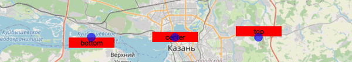
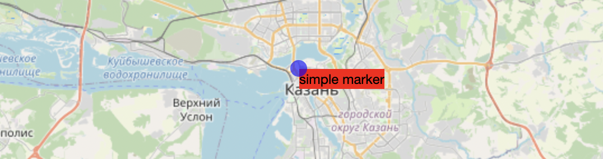
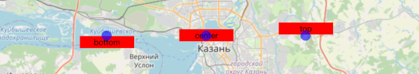
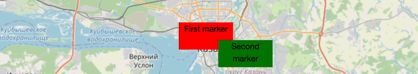
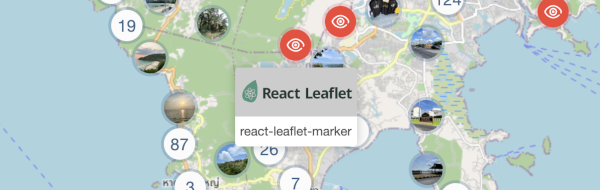

# react-leaflet-marker
Custom markers for react-leaflet maps.

You can use any react component with version of [react-leaflet](https://github.com/PaulLeCam/react-leaflet) 3.x.x

[](https://www.npmjs.com/package/react-leaflet-marker)
[](https://npmjs.org/package/react-leaflet-marker)
[](https://github.com/holytrips/react-leaflet-marker/actions/workflows/ci.yml)
[](https://github.com/holytrips/react-leaflet-marker/blob/master/LICENSE)

### Support zoom animation


## Install
```sh
npm i react-leaflet-marker --save
```

## Get started

```javascript
import React from "react";
import { MapContainer } from "react-leaflet";
import { MarkerLayer, Marker } from "react-leaflet-marker";

const ReactMarker = () => (
    <MapContainer
        {/* ...MapContainerProps react-leaflet */}
        center={[55.796391, 49.108891]}
        zoom={10}
    >
        <MarkerLayer>
            <Marker
                position={[55.796391, 49.108891]}
            >
                <div>Hi, i'm a react element</div>
            </Marker>
        </MarkerLayer>
    </MapContainer>
);

export default ReactMarker;
```
## Examples

### Simple marker with flexible size
Markers without `size` can't take `placement` props.


```javascript
<MarkerLayer>
    <Marker
        position={[55.796391, 49.108891]}
    >
        <div style={{
            background: 'red'
        }}>
            simple{'\u00A0'}marker
        </div>
    </Marker>
</MarkerLayer>
```

### Marker with fixed size
Just add `size` props. It is the best practice the most cases.


```javascript
<MarkerLayer>
    <Marker
        position={[55.796391, 49.108891]}
        size={[80, 20]} // required for placement
        // you can use optional `placement`
        placement="center" // "top", "bottom"
    >
        <div style={{
            background: 'red',
            textAlign: 'center'
        }}>
            center
        </div>
    </Marker>
</MarkerLayer>
```

### Rise on hover
The marker will get on top of others when you hover the mouse over it.


```javascript
<MarkerLayer>
    <Marker
        position={[55.796391, 49.108891]}
        size={[80, 40]}
        interactive // required for riseOnHover
        riseOnHover
    >
        <div style={{
            background: 'red',
            textAlign: 'center'
        }}>
            First marker
        </div>
    </Marker>
</MarkerLayer>
```

### Use any react component as marker

For example, I used [antd](https://github.com/ant-design/ant-design/) dropdown and custom icons



## Props

| Name       | Default                       | Type                                                                                                                      | Description |
| ---------- | ----------------------------- | -------------------------------------------------------------------------------------------------------------------------------- | --- |
| `position`   | - | LatLngExpression | Lat Lng coordinates |
| `innerRef`?  | - | MutableRefObject |  |
| `riseOnHover`? | false | bool | If `true`, the marker will get on top of others when you hover the mouse over it.If `true`, the marker will get on top of others when you hover the mouse over it. |
| `riseOffset`? | 250 | number | The z-index offset used for the `riseOnHover` feature. |
| `zIndexOffset`? | 0 | number | By default, marker images zIndex is set automatically based on its latitude. Use this option if you want to put the marker on top of all others (or below), specifying a high value like `1000` (or high negative value, respectively). |
| `interactive`? | false | bool | If set `false`, the marker won't respond to mouse |
| `size`? | - | [width: number, height: number] | Size marker. Required for `placement` |
| `placement`? | center | string | One of `top`, `center`, `bottom` |